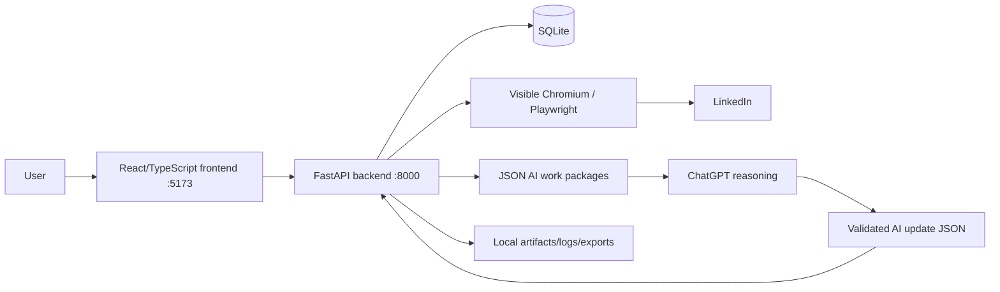

# JOLT Architecture

## Runtime topology

JOLT is local-first and currently single-user. Windows launcher scripts orchestrate dependency sync, Alembic migrations, backend/frontend startup, local logs and browser opening.

## Major backend responsibilities
- **Capture/evidence**: supervised LinkedIn capture, fixture/manual intake, capture runs/items/pages/artifacts, source documents, posting identity and provenance.
- **Review/evaluation**: opportunity index, human review decisions, deterministic hardline evidence, strategy/evaluation metadata, AI review pack/import.
- **Applications**: application creation, transitions, archival/deletion rules, readiness, tasks, interviews, contacts, documents, outcomes and preparation packs.
- **LinkedIn intelligence**: profile/network/activity captures, command center, recommendations and AI exchange.
- **Market intelligence**: bounded persisted capture observations, market preparation/export/import and AI feedback.
- **AI exchange**: global context, candidate evidence, unified work package, per-section exchange contracts, feedback persistence and import validation.
- **System/data management**: runtime identity, retention/ownership preview, backup/export, preferences, cleanup/archive behavior.

Primary backend entrypoint: `backend/src/jolt/main.py`. Persistence is SQLAlchemy + Alembic migrations under `backend/migrations/`.

## Major frontend responsibilities
`frontend/src/` implements the workbench and section views. Major user surfaces are Capture Jobs/Professional Intelligence, Review Inbox, Applications, LinkedIn Profile/Command Center, Market Insights and Settings & Data. The frontend calls the local FastAPI API and does not own durable business state.

## Core data flow
1. Capture/manual intake creates source evidence and capture provenance.
2. Posting identity normalizes/deduplicates source items.
3. Pending opportunities are exposed to Review Inbox.
4. Human or externally reasoned review metadata is stored separately from source evidence.
5. Pursue creates durable Application state; lower-level capture cleanup cannot destroy it.
6. Outcomes and market evidence feed later AI exchanges.
7. Unified AI package exports current authoritative evidence; ChatGPT returns structured output; importer validates contract, IDs, hardlines and ownership before persistence.

## Trust/security boundaries
- LinkedIn credentials remain in the user's interactive browser context; JOLT must not store credentials or bypass login/checkpoints/CAPTCHA.
- Source evidence is immutable/auditable input; AI output is derived and cannot overwrite source evidence or human-owned application decisions.
- Deterministic validators may reject invalid AI returns; deterministic evidence must itself be regression-tested because it is authoritative for import safety.
- Browser automation is supervised and bounded, not an unattended crawler.

## Critical invariants
- Application state > review decision > posting identity > source lineage > capture lifecycle > UI state.
- Archive/hide is preferred to destructive deletion for central domain records.
- `Remote` is not equivalent to global eligibility.
- AI Stage 1 hardlines precede technical fit.
- Positive AI decisions require eligible geography and clear language/clearance states.
- Invalid LinkedIn authwall/checkpoint captures are audit data, not candidate evidence.

## Known architectural weaknesses
- Historical code/docs include two version numbers: FastAPI `0.8.0` vs backend package `0.1.0`.
- Capture architecture evolved through a historical split between normal capture and Professional evidence; current code has converged substantially, but older docs must not be mistaken for current runtime truth.
- Several backend responsibilities still meet in a large `main.py` route composition layer.
- Local runtime can be stale relative to repository checkout without sufficiently obvious warning.
- Deterministic hardline parsing can create high-impact false rejects if token/context rules are too broad; PR #380 is the current example.
- Some AI/LinkedIn UX changes are still open PRs and therefore are not part of `main`.

## Authoritative references
- `PROJECT_MEMORY.md`: durable product invariants and ownership rules.
- `docs/domain-model.md`: persisted domain concepts.
- `docs/jolt-architecture-audit-20260729.md`: historical capture/ownership failure and why archive semantics matter.
- `backend/src/jolt/main.py`: current API composition.
- `backend/src/jolt/database.py` + migrations: persistence authority.
- `backend/src/jolt/ai_review_import.py`, `ai_review_pack.py`, `review_inbox_exchange.py`: current AI review contracts.
- `.github/workflows/`: merge/test gates.