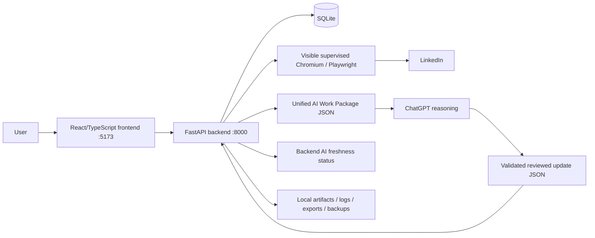

# JOLT Architecture

## Runtime topology

```mermaid
flowchart LR
  U[User] --> F[React/TypeScript frontend :5173]
  F --> A[FastAPI backend :8000]
  A --> D[(SQLite)]
  A --> C[Visible supervised Chromium / Playwright]
  C --> L[LinkedIn]
  A --> W[Unified AI Work Package JSON]
  W --> G[ChatGPT reasoning]
  G --> R[Validated reviewed update JSON]
  R --> A
  A --> S[Backend AI freshness status]
  A --> E[Local artifacts / logs / exports / backups]
```

JOLT is local-first, single-user and certified for supported Windows x64 operation. Windows launcher scripts orchestrate dependency sync, Alembic migrations, backend/frontend startup, local logs and browser opening.

## Product workflow
`capture/manual intake -> preserved evidence -> normalized posting -> frozen discovery review set -> ChatGPT AI review -> Review Inbox -> human Apply/Reject/pending -> durable Application -> events/outcome -> aggregate intelligence feedback`.

Major UI surfaces:
- Capture Jobs
- Review Inbox
- Applications
- LinkedIn Profile
- Market Insights
- Settings & Data

Each surface has a separate operator question; shared evidence does not erase lifecycle boundaries.

## Durable ownership hierarchy
1. Human-created Application state
2. Human review decisions
3. Durable posting/opportunity identity
4. Source/evidence lineage
5. Capture-run lifecycle
6. Temporary UI state

A lower layer must never destroy or hide a higher layer.

Applications are indexed from durable Application + Posting/workflow state. Since PR #466, legacy Python `Evaluation` is not required for an existing Application to remain visible.

## AI reasoning architecture

### Supported product path
The **Unified AI Work Package** is the sole product workflow allowed to persist durable global AI context.

Normal discovery:
1. A discovery batch freezes only its new/deduplicated review set.
2. JOLT exports a batch-scoped Unified AI Work Package containing those jobs plus bounded aggregate evidence/context exchanges.
3. ChatGPT performs source-first Stage-1 hardline review per job before fit reasoning and may refresh aggregate intelligence.
4. One validated import persists per-job `AIReview`, feedback/recommendations and the top-level durable `context_patch`.
5. Backend `GET /api/ai-status` derives freshness from persisted evidence and imported reasoning timestamps.

### Legacy/diagnostic paths
Individual section exchanges and standalone review/preparation exports/imports remain for compatibility and diagnostics but are deprecated.
They may still persist section feedback/recommendations/actions, but **section-level `context_patch` must be empty**. They cannot write durable global AI strategy.

Direct `/api/ai-context/import` is deprecated and write-blocked.

Do not build new product workflows on deprecated AI mutation routes.

## AI authority boundaries
- Source evidence is immutable/auditable input.
- ChatGPT owns judgment-heavy reasoning.
- JOLT owns deterministic capture, provenance, validation, persistence, schema checks and UI calculations.
- Human decisions and Application workflow state cannot be overwritten by AI.
- Global durable AI context is applied atomically only from the Unified Work Package top-level patch.
- Browser localStorage is not intelligence authority.
- `/api/ai-status` is the freshness authority for Review Inbox, Market Insights, Applications, LinkedIn Profile, Search Strategy, Skills Gaps, Professional Evidence and Data Quality.

## Review authority
Review Inbox uses imported `AIReview` as its classifier/reasoning authority. Legacy deterministic `Evaluation` may remain in historical/capture-support code but must not become a second user-facing scoring authority.

Human daily decisions are intentionally simple:
- Apply -> durable Application workflow;
- Reject -> durable human rejection;
- no action -> remains pending.

## Major backend responsibilities
- **Capture/evidence**: supervised LinkedIn capture, manual intake, capture runs/items/pages/artifacts, source documents, posting identity/provenance.
- **Discovery portfolio**: saved searches, sequential batches, restart reconciliation and performance funnel.
- **Review**: batch-scoped/unified AI review, hardline validation, AIReview persistence, human decision state.
- **Applications**: transitions, tasks, interviews, contacts, documents, outcomes, timeline and retention guarantees.
- **LinkedIn intelligence**: profile/network/activity evidence and recommendations.
- **Market intelligence**: bounded observations, persisted AI market summary/strategy and action-oriented dashboard.
- **AI exchange**: Unified Work Package, feedback persistence, backend freshness status, deprecated section compatibility exchanges.
- **System/data**: runtime identity, backup/restore, migrations, retention/ownership, preferences and diagnostics.

Primary backend composition remains `backend/src/jolt/main.py`; domain logic is distributed into bounded modules. Persistence is SQLAlchemy + Alembic.

## Browser and external-site boundary
- LinkedIn credentials remain in the user's interactive browser profile.
- JOLT does not store credentials or bypass login/checkpoints/CAPTCHA.
- Browser automation is supervised and bounded, not unattended mass crawling.
- Authwall/checkpoint/network/safety failures fail closed.
- Missing LinkedIn/profile evidence means unknown, not absent.

## Release/test boundary
Production-affecting changes retain exact-head certification:
- backend pytest/Ruff/Pyright;
- frontend tests/build;
- Playwright/sidebar-kanban;
- full-cycle + 1680x945 viewport fit;
- clean-install Windows;
- migration recovery;
- reproducible release;
- Windows script contract.

Do not weaken certifications to make a feature pass.

## Current technical debt
- `backend/src/jolt/main.py` remains a broad route-composition surface; split only when related work justifies it.
- Deprecated AI section/legacy endpoints still exist for compatibility and should be removed only after an explicit compatibility checkpoint.
- Some historical docs describe superseded capture/AI architecture; `.ai/`, source and tests outrank them.
- The historical `Evaluation` model still exists for legacy deterministic/capture support, but Applications and Review Inbox must not depend on it as current reasoning authority.

## Authoritative references
- `PROJECT_MEMORY.md`: durable product/ownership rules.
- `.ai/CONTEXT.md`, `.ai/PROJECT_STATE.json`, `.ai/ROADMAP.md`, `.ai/KNOWN_ISSUES.md`: current control layer.
- `backend/src/jolt/unified_ai_work_package.py`: supported AI round-trip composition/import authority.
- `backend/src/jolt/ai_status.py`: intelligence freshness authority.
- `backend/src/jolt/ai_review_import.py` + batch review modules: job-review validation.
- `backend/src/jolt/database.py` + migrations: persistence authority.
- `.github/workflows/*`: production merge/test gates.
